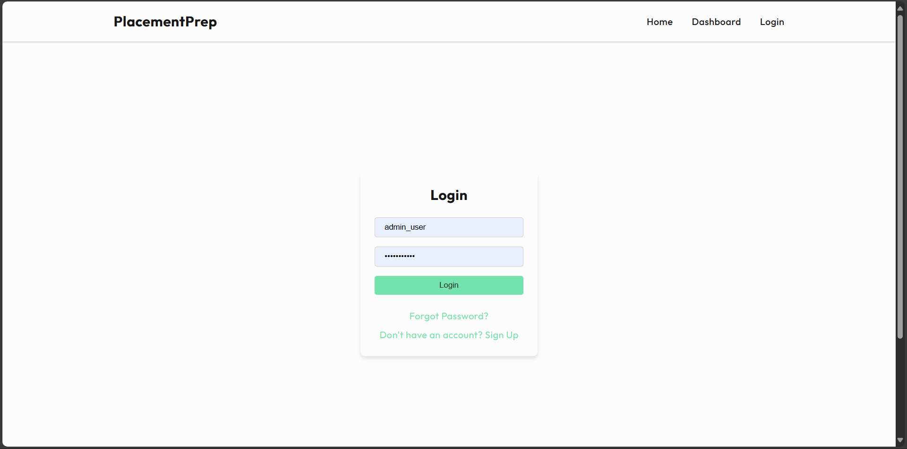
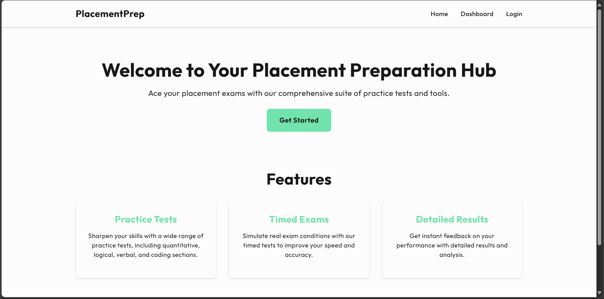
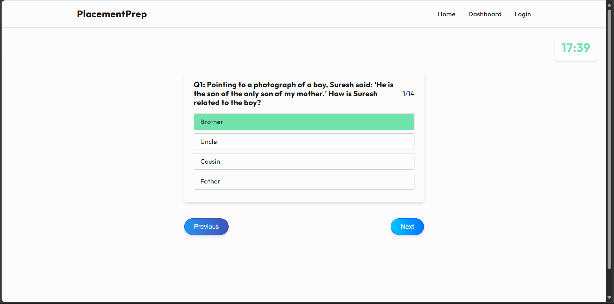
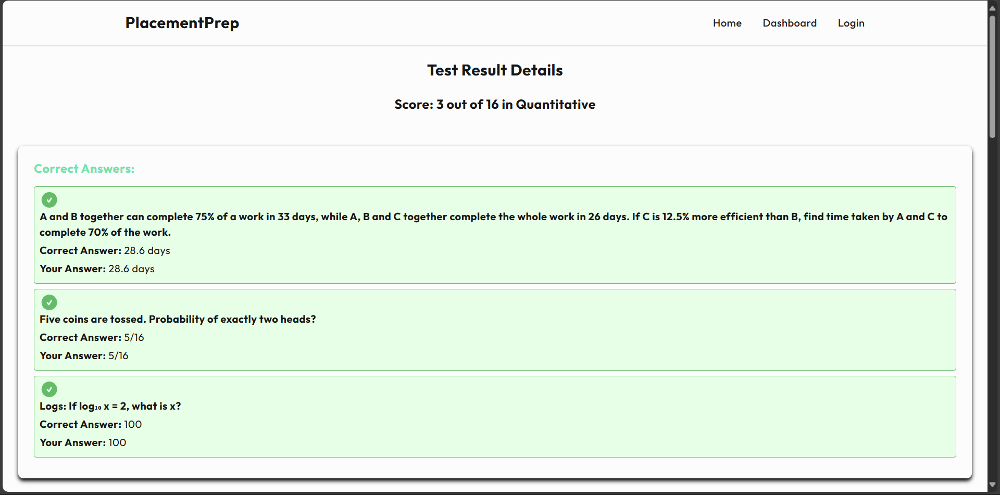
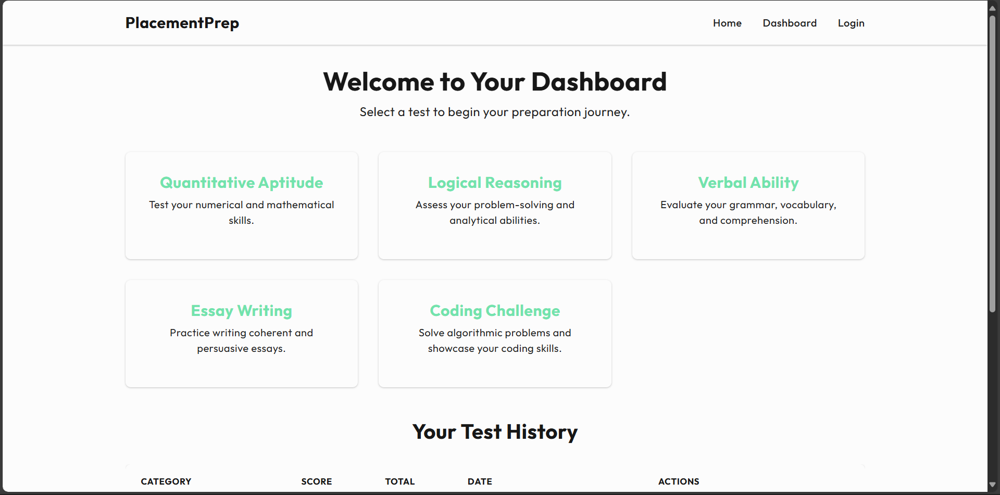
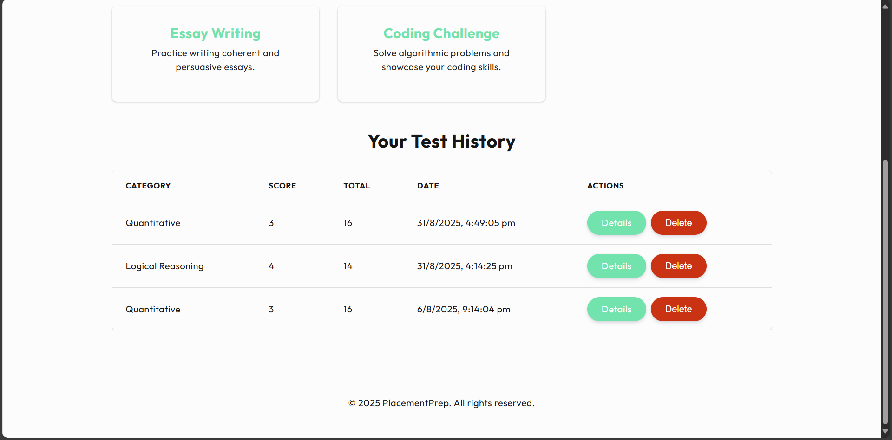
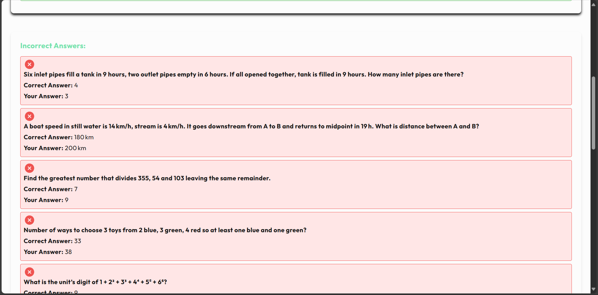

# Placement Preparation App

## Project Overview

The Placement Preparation App is a comprehensive platform designed to help students prepare for placement exams. It offers a variety of practice tests across different domains, simulates timed exam conditions, and provides detailed results and analysis to help users improve their performance.

### Key Features:

*   **Practice Tests:** Sharpen your skills with a wide range of practice tests, including quantitative, logical, verbal, and coding sections.
*   **Timed Exams:** Simulate real exam conditions with timed tests to improve your speed and accuracy.
*   **Detailed Results:** Get instant feedback on your performance with detailed results and analysis.
*   **User Authentication:** Secure login and registration for personalized experience.
*   **Dashboard:** View test history and access different test categories.

## Technology Stack

### Frontend

*   **React:** A JavaScript library for building user interfaces.
*   **React Router:** For declarative routing in React applications.
*   **CSS Modules:** For local scoping of CSS classes.

### Backend

*   **Flask:** A lightweight Python web framework.
*   **MongoDB:** A NoSQL database used for storing questions, user data, and results.
*   **PyMongo:** A Python distribution containing tools for working with MongoDB.
*   **Flask-CORS:** A Flask extension for handling Cross Origin Resource Sharing (CORS).
*   **python-dotenv:** For loading environment variables from a `.env` file.
*   **PyJWT:** For JSON Web Token implementation for secure user authentication.

## Setup and Installation

Follow these steps to set up and run the Placement Preparation App on your local machine.

### Prerequisites

*   Node.js and npm (or yarn) installed (for frontend)
*   Python 3.x installed (for backend)
*   MongoDB instance running and accessible

### Backend Setup

1.  **Navigate to the `server` directory:**
    ```bash
    cd server
    ```

2.  **Create a Python virtual environment:**
    ```bash
    python -m venv venv
    ```

3.  **Activate the virtual environment:**
    *   **On Windows:**
        ```bash
        .\venv\Scripts\activate
        ```
    *   **On macOS/Linux:**
        ```bash
        source venv/bin/activate
        ```

4.  **Install backend dependencies:**
    ```bash
    pip install -r requirements.txt
    ```

5.  **Create a `.env` file in the `server` directory** and add the following environment variables. Replace the placeholder values with your actual MongoDB connection string and a strong secret key.

    ```
    SECRET_KEY='your_very_secret_key_here'
    MONGO_URI='mongodb://localhost:27017/'
    MONGO_DB_NAME='questionsdb'
    ```
    *   `SECRET_KEY`: A secret key for Flask sessions and JWT encoding.
    *   `MONGO_URI`: Your MongoDB connection URI.
    *   `MONGO_DB_NAME`: The name of your MongoDB database (e.g., `questionsdb`).

6.  **Run the Flask backend:**
    ```bash
    python app.py
    ```
    The backend server will typically run on `http://127.0.0.1:5000`.

### Frontend Setup

1.  **Navigate to the `client` directory:**
    ```bash
    cd client
    ```

2.  **Install frontend dependencies:**
    ```bash
    npm install
    # or yarn install
    ```

3.  **Run the React frontend:**
    ```bash
    npm start
    # or yarn start
    ```
    The frontend application will typically open in your browser at `http://localhost:3000`.

## Screenshots

Here are some screenshots of the application in action:

### Login Page


### Dashboard


### Quiz Page


### Result Page


### Dashboard (Alternative View 1)


### Dashboard (Alternative View 2)


### Result Page (Alternative View)


## License

This project is licensed under the MIT License - see the [LICENSE](LICENSE) file for details.
